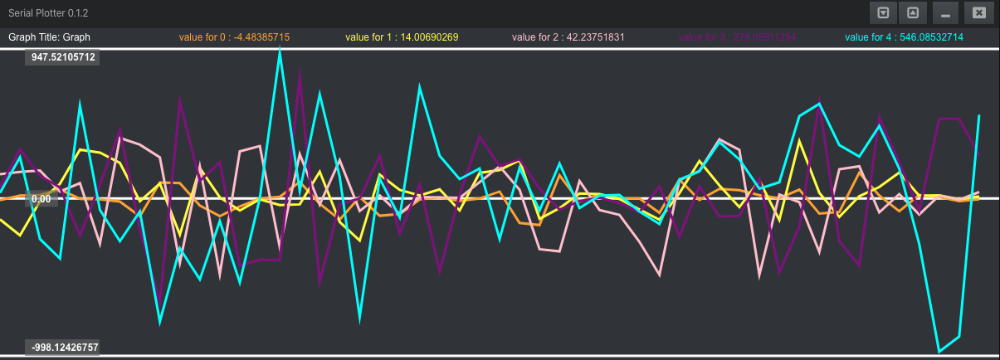

# Serial-Plotter Package

Package for Atom text editor to show data from a serial port.

I did this to show data from an Arduino (or anything else), sent by this library: https://github.com/devinaconley/arduino-plotter

(+) Reads up to 5 continuous multi-variable plots against time
(-) No Support for XY-graphs yet

Dependencies:
(-) Python with Serial library installed
(-) Atom "file-icons" package

this thing is working but still work-in-progress...

in Settings.json you can change your standard baudrate, window height, resolution (number of data points in width), etc..

--------
Special thanks to wendlers 'Sermon' Package ( https://atom.io/packages/sermon ), where I found a way to read serial data inside Atom
